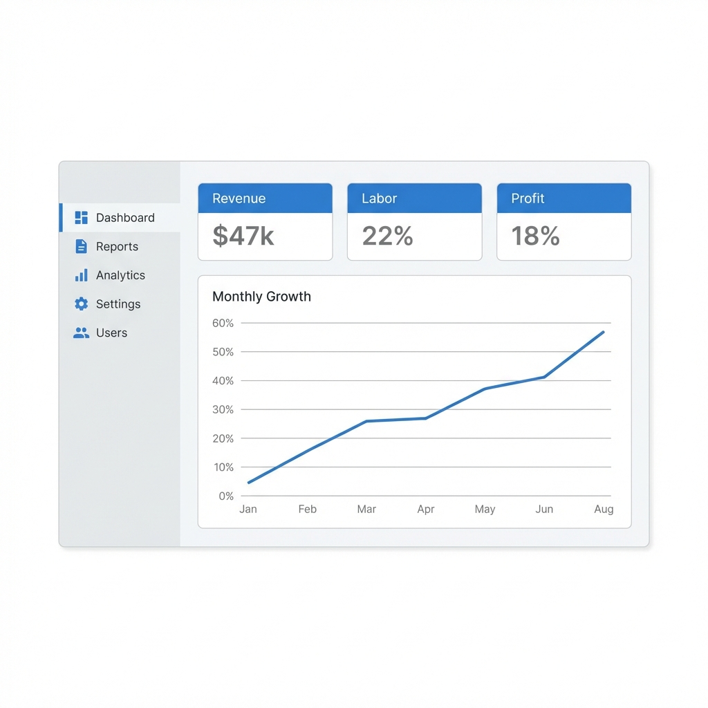
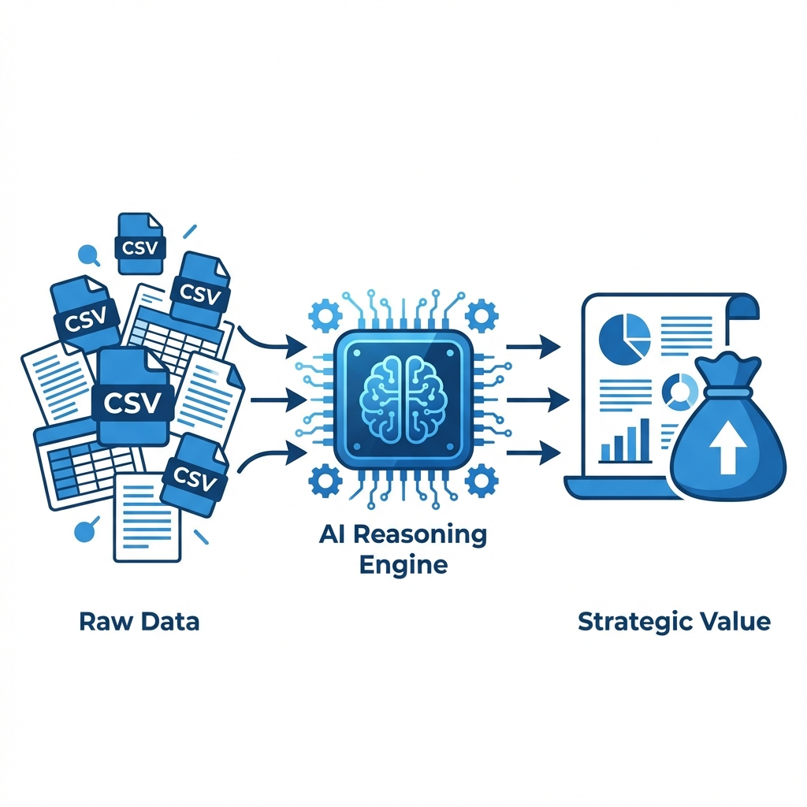
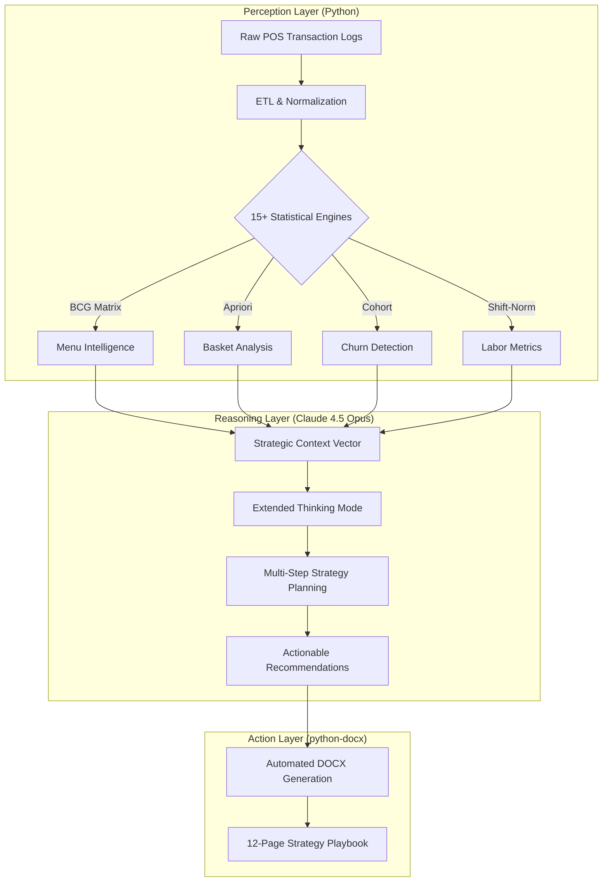

# 🍽️ RestoAI

### Your Restaurant's Data is a Goldmine. This Agent Turns It Into a $47K Strategy—In 4 Minutes.

Not a dashboard. Not a chatbot. **A fully autonomous business strategist.**

---

## 🎯 The Problem

Running a restaurant is brutal. You're drowning in data but starving for answers.

Every restaurant owner faces the same impossible choice:

- 💸 **Hire a consultant** — $10,000–$25,000, weeks of waiting, generic advice
- 📊 **Do it yourself in Excel** — 20+ hours of manual analysis, still only scratching the surface
- 🤖 **Ask ChatGPT** — Token limits, hallucinated numbers, no statistical rigor
- 📉 **Do nothing** — Watch menu items die, VIP customers churn, and labor costs bleed money

Meanwhile, your competitors are already optimizing.

**The real problem?** You have 32,000+ transactions sitting in a CSV file that could tell you exactly:
- Which menu items are losing money
- Which VIP customers stopped coming
- When you're overstaffed (and hemorrhaging cash)
- What upsells you're missing

But extracting that intelligence manually? Impossible.

---

## 💡 The Solution: Autonomous Business Intelligence

What if AI didn't just analyze your data—but thought like a $500/hour consultant?

**RestoAI is a Level 3 Autonomous Agent.** Give it your POS data, and it:

1. **Ingests** — Processes 32,000+ messy transactions from Toast, Square, or any POS system
2. **Analyzes** — Runs 15+ statistical models (BCG Matrix, Market Basket Analysis, Cohort Churn, Time-Series Forecasting)
3. **Reasons** — Uses Claude Opus 4.5's Extended Thinking to connect insights and generate strategy
4. **Delivers** — A 12-page professional consultant report with a 90-day action plan

⏱️ **Total time:** 4 minutes. Zero human input required.

---

## 💰 What This Agent Delivers

The first deployment identified **$47,000+ in annual revenue opportunities** the owner had zero visibility into.

| Impact Area | What It Finds | Real Result |
|-------------|---------------|-------------|
| **📈 Revenue Leaks** | Underpriced items, missed upsells, dying products | **+$32,000/year** in menu optimization |
| **👥 Customer Loss** | VIPs who stopped coming (and why) | **$8,400** in recoverable lifetime value |
| **⏰ Labor Waste** | Overstaffed shifts, scheduling gaps | **$6,500/year** in labor savings |
| | | **= $47,000+ identified in first deployment** |

**Time to insight:** 4 minutes.  
**Cost of a consultant doing this:** $10,000–$25,000.

---

## 🧠 Cognitive Architecture

RestoAI isn't a simple script wrapper. It operates on a **Perception-Reasoning-Action** loop designed to mimic a human analyst's workflow:

### 1. Perception Layer (The "Eyes")
**Technology:** Python | Pandas | NumPy
- Ingests 32,000+ transactions from raw POS exports
- Runs **15+ specialized statistical modules** covering menu engineering, customer churn, basket analysis, labor optimization, and trend forecasting
- Compresses findings into a **5KB Strategic Context** (>1,600x reduction)

### 2. Reasoning Layer (The "Brain")
**Technology:** Claude Opus 4.5
- **Engine Choice**: Selected for **Extended Thinking** capabilities. In benchmarks, Opus 4.5 outperforms GPT-4o on multi-step reasoning tasks involving math-heavy business logic.
- **Cognition**: It doesn't hallucinate math. It takes the *proven* statistics from the Perception Layer and applies **strategic deduction** (e.g., *"If X is a high-margin Puzzle item and Y pairs with it, then bundle X+Y to drive volume"*).

### 3. Action Layer (The "Hands")
**Technology:** python-docx | Visualization Engines
- **Output**: Generates a professional 12-page DOCX report.
- **Deliverables**: Specific menu changes, win-back email templates, and staffing roster adjustments.

---

## 🔬 Engineering Deep Dive

### 🤖 Why Claude Opus 4.5?

I chose **Claude Opus 4.5** for the Reasoning Layer due to its state-of-the-art performance in complex enterprise strategy. With its **64K Extended Thinking** window and **92.8% score on AIME 2025 mathematical reasoning**, Claude provides the "investigative depth" necessary to connect 15+ independent data modules into a coherent 12-page playbook. Unlike standard LLMs that often hallucinate math or lose context, Claude’s verifiable reasoning allows it to act as a **Senior Strategy Consultant**, pinpointing non-obvious correlations between labor spikes and menu velocity while maintaining a consistent ROI-focused narrative across long-horizon reports.

### Solving "Shift Bias"
Raw data lies. A Friday dinner server always looks better than a Tuesday lunch server.
**Solution:** I implemented a **Shift-Normalization Algorithm** that benchmarks every employee against their specific time-slot average.
*   *Result:* Identified a "top performer" who was actually underperforming their prime-time potential by 15%.

### Scalability Architecture
Designed for multi-tenant deployment from Day 1:
- **Hierarchical Schema**: Supports `Franchise -> Location -> POS_Terminal` data relationships.
- **Modular Micro-Analyses**: Each analysis (Churn, Basket, Menu) is an isolated module, allowing for hot-swapping logic without breaking the core agent.

---

## 🔢 The 15 Statistical Modules

**For hiring managers:** Here's the full technical breakdown of the analysis engines.

#### Menu Intelligence Engines
1. **BCG Matrix Classifier** — Categorizes every menu item as Star/Puzzle/Plowhorse/Dog
2. **Price Elasticity Analyzer** — Detects underpriced high-margin items
3. **Menu Velocity Tracker** — Identifies declining items before they tank
4. **Profit Margin Calculator** — True per-item profitability (not just revenue)

#### Customer Intelligence Engines
5. **Cohort Churn Detector** — Flags VIP customers who stopped visiting
6. **Lifetime Value Calculator** — Quantifies how much each lost customer costs you
7. **Frequency Segmentation** — Groups customers by visit patterns (daily/weekly/monthly)

#### Basket & Cross-Sell Engines
8. **Apriori Association Rules** — Finds statistically significant item pairings
9. **Lift Score Calculator** — Validates which combos actually drive purchases (Lift > 1.5)
10. **Bundle Opportunity Mapper** — Suggests specific combo pricing

#### Labor & Operations Engines
11. **Shift-Normalized Performance Scorer** — Fair employee comparisons across time slots
12. **Revenue-per-Labor-Hour Calculator** — Identifies overstaffed/understaffed shifts
13. **Peak Detection Algorithm** — Maps exact busy hours vs. slow periods

#### Trend & Forecasting Engines
14. **Time-Series Decomposition** — Separates seasonality from true growth
15. **Anomaly Detection** — Alerts on unusual spikes/drops

---

## 📄 Sample Report Output

**This isn't just charts and graphs. It's a playbook.**

Here's what the actual report looks like (anonymized example):

> *Note: All numbers and item names have been changed for privacy. The format and insights shown are representative of actual output.*

### Menu Engineering Classification

| Class | What It Means | Count | Strategy |
|-------|---------------|-------|----------|
| ⭐ **STAR** | Popular AND profitable | 85 items | Feature prominently. Never change. |
| 🧩 **PUZZLE** | Profitable but not popular | 28 items | Hidden gems - promote these! |
| 🐴 **PLOWHORSE** | Popular but low profit | 41 items | Raise prices slightly |
| 🐕 **DOG** | Not popular, not profitable | 76 items | **Remove 25+ of these** |

#### Hidden Gems to Promote (Puzzles)
| Item | Revenue | What To Do |
|------|---------|------------|
| Premium Side Dish | $1,800 | Feature with entrees - 85% pair rate! |
| Specialty Fries | $2,700 | Premium upsell from regular fries |

**💡 WHAT THIS MEANS:** You have 76 DOG items generating only $1,000/year combined - less than $3/day! **Goal: Remove at least 25 Dog items this quarter.**

---

### Upsell Opportunities

| Upgrade | Current Rate | Opportunity |
|---------|--------------|-------------|
| Double Patty | 24% | Train staff to always ask |
| Premium Cheese | 22% | "Would you like cheese?" |

**The Upsell Script That Makes Money:**
> *"Would you like to make that a double for just $4 more?"*  
> **Impact:** +$4,200/year if you increase attach rate from 24% → 30%

**💡 WHAT THIS MEANS:** Your customers ARE willing to pay more. You just have to ask.

---

### Team Performance

| Employee | Their Avg Ticket | Shift Avg | Performance |
|----------|------------------|-----------|-------------|
| Top Performer | $58 | $31 | **+87%** 🔥 |
| Team Average | $31 | $31 | Baseline |

**💡 WHAT THIS MEANS:** Your top performer is averaging nearly DOUBLE the team. Have them train everyone on their approach.

---

## 🔮 Roadmap

| Phase | Capability | Status |
|-------|------------|--------|
| **v1.0** | Autonomous Report Generation | ✅ **Production** |
| **v1.5** | Multi-Location Benchmarking | ✅ **Production** |
| **v2.0** | Real-time Toast/Square API Hooks | 🚧 In Development |
| **v3.0** | "Chat with Data" (RAG Interface) | 📅 Planned |

---

## 🛠 Tech Stack
`Python` `Pandas` `Claude Opus 4.5` `Google Vertex AI` `Matplotlib`

---

## 💼 Skills Demonstrated

This project showcases expertise in:

### AI & Machine Learning
- **LLM Integration**: Production deployment of Claude Opus 4.5 with Extended Thinking mode
- **Prompt Engineering**: Architecting compressed context for complex multi-step reasoning
- **Model Selection**: Choosing the right AI model based on benchmark performance for statistical tasks

### Software Architecture
- **Agent Design**: Building autonomous systems with Perception-Reasoning-Action loops
- **Modular Systems**: 15+ isolated analysis modules with clean interfaces
- **Scalability**: Multi-tenant architecture supporting hierarchical data relationships

### Data Engineering
- **ETL Pipelines**: Processing messy real-world data (date parsing, currency normalization, inconsistent formats)
- **Statistical Analysis**: Implementing BCG Matrix, Apriori algorithms, cohort analysis, time-series decomposition
- **Data Compression**: Reducing 32,000+ rows to 5KB context while preserving signal

### Business Intelligence
- **Domain Translation**: Converting technical outputs into executive-level recommendations
- **ROI Quantification**: Projecting dollar impact for every strategic recommendation
- **Cross-functional Communication**: Writing for both technical and non-technical audiences

### Product Development
- **End-to-End Ownership**: From data ingestion to professional report generation
- **Production Deployment**: Running live analysis for multi-location business
- **User-Centric Design**: Delivering actionable scripts and week-by-week implementation plans

---

## 👨‍💻 About the Developer

**Akshay Sapkale** | AI & Business Strategist

I build autonomous AI systems that solve real business problems. This project emerged from a simple question: *"Can AI replace a $25,000 consultant?"*

The answer was yes—but only if you architect it correctly. Most people try to dump raw data into ChatGPT and hope for magic. I built RestoAI using a rigorous engineering approach: Python handles the math, AI handles the narrative, and the output drives measurable ROI.

**What I bring to your team:**
- **AI Engineering**: Deep experience with LLM integration, agent frameworks, and production AI systems
- **Full-Stack Thinking**: I don't just build models—I build complete solutions from data ingestion to user delivery
- **Business Focus**: Every technical decision is tied to measurable business impact

This repository demonstrates my ability to independently architect, build, and deploy AI systems that create real value.

---

> *Note: This repository showcases the agentic architecture and business impact. Proprietary source code is not included.*
