# Restaurant Intelligence System — Technical Documentation

> **For Developers**: Deep dive into implementation details, algorithms, and code architecture.

---

## Table of Contents

1. [The Key Innovation: Smart Pre-Processing](#the-key-innovation-smart-pre-processing)
2. [AI Integration Architecture](#ai-integration-architecture)
3. [Analysis Modules Implementation](#analysis-modules-implementation)
4. [Technology Stack Details](#technology-stack-details)
5. [Code Examples](#code-examples)

---

## The Key Innovation: Smart Pre-Processing

### Why Not Just Feed Raw Data to the LLM?

Sending 32,000 raw transaction rows to an LLM is:
- ❌ **Token-prohibitive** — Would exceed context limits
- ❌ **Computationally wasteful** — LLMs aren't designed for number-crunching
- ❌ **Insight-limited** — No statistical rigor, no classification methodology

### The "Calculated Intelligence" Approach

```
┌─────────────────────────────────────────────────────────────────────────────┐
│                        THE INTELLIGENCE PIPELINE                            │
├─────────────────────────────────────────────────────────────────────────────┤
│                                                                             │
│   📊 32,000+ Raw Transactions                                               │
│              │                                                              │
│              ▼                                                              │
│   ┌─────────────────────────────────────────────────────────────────┐      │
│   │              🐍 PYTHON ANALYSIS ENGINE                          │      │
│   │  • Menu Engineering (BCG Matrix classification)                 │      │
│   │  • Basket Analysis (Support, Confidence, Lift calculations)     │      │
│   │  • Churn Detection (cohort-based customer analysis)            │      │
│   │  • Shift-Normalized Employee Performance                        │      │
│   │  • Time Pattern Analysis (hourly/daily/seasonal)               │      │
│   │  • 15+ specialized analysis modules                             │      │
│   └──────────────────────────┬──────────────────────────────────────┘      │
│                              │                                              │
│                              ▼                                              │
│   ┌─────────────────────────────────────────────────────────────────┐      │
│   │        📋 STRUCTURED CONTEXT DOCUMENT (~5KB vs 8MB)             │      │
│   │  Pre-calculated metrics, classifications, trends, alerts        │      │
│   └──────────────────────────┬──────────────────────────────────────┘      │
│                              │                                              │
│                              ▼                                              │
│   ┌─────────────────────────────────────────────────────────────────┐      │
│   │              🤖 CLAUDE OPUS 4.5 (Extended Thinking)             │      │
│   │  • Strategic interpretation of pre-calculated data              │      │
│   │  • Natural language explanations for business owners            │      │
│   │  • ROI projections and action plan generation                   │      │
│   │  • Cross-metric insight synthesis                                │      │
│   └──────────────────────────┬──────────────────────────────────────┘      │
│                              │                                              │
│                              ▼                                              │
│   📄 12-Page Professional Intelligence Report (DOCX)                        │
│                                                                             │
└─────────────────────────────────────────────────────────────────────────────┘
```

**The result?** Python handles the **computation**, AI handles the **communication** — each doing what it does best.

---

## AI Integration Architecture

### Claude Opus 4.5 with Extended Thinking

The report narrative is generated using **Claude Opus 4.5**, specifically chosen for its:

| Capability | Application |
|------------|-------------|
| **Extended Thinking Mode** | Multi-step reasoning for complex business recommendations |
| **Context Synthesis** | Connecting insights across 15+ analysis dimensions |
| **Business Acumen** | Writing for restaurant owners, not data scientists |
| **Actionable Output** | 90-day implementation plans with projected ROI |

### Prompt Engineering Architecture

The AI receives a **structured context document** containing:
- Pre-calculated metrics with growth rates
- BCG-classified menu items (Stars, Puzzles, Plowhorses, Dogs)
- Basket analysis pairs with statistical significance (Lift > 1.0)
- Churned customer lists with lifetime value
- Shift-normalized employee performance deltas
- Time series patterns and anomalies

---

## Analysis Modules Implementation

### 1. Menu Engineering (BCG Matrix)

```python
def analyze_item_performance(df):
    """
    Apply BCG Matrix methodology to classify every menu item.
    
    Classifications:
    ⭐ Star     - High volume + High revenue  → Protect and feature
    🧩 Puzzle  - Low volume + High margin    → Promote to increase volume
    🐴 Plowhorse - High volume + Low margin  → Consider price increase
    🐕 Dog     - Low volume + Low margin     → Consider removing
    """
    avg_revenue = item_stats['Net Sales'].mean()
    avg_quantity = item_stats['Qty'].mean()
    
    def classify_item(row):
        high_rev = row['Net Sales'] >= avg_revenue
        high_qty = row['Qty'] >= avg_quantity
        if high_rev and high_qty:
            return 'Star'
        elif high_rev and not high_qty:
            return 'Puzzle'
        elif not high_rev and high_qty:
            return 'Plowhorse'
        else:
            return 'Dog'
    
    item_stats['Menu_Class'] = item_stats.apply(classify_item, axis=1)
```

### 2. Customer Churn Detection

```python
def analyze_customer_churn(df):
    """
    Identify VIP customers who haven't visited recently (churn risk).
    Uses cohort analysis to compare first-half vs recent activity.
    """
    # Split data into time periods
    mid_point = df['Date'].min() + (df['Date'].max() - df['Date'].min()) / 2
    recent_cutoff = df['Date'].max() - pd.Timedelta(days=90)
    
    # Find customers active in first half but absent in last 90 days
    first_half_visitors = df[df['Date'] <= mid_point].groupby('Customer ID')
    recent_visitors = df[df['Date'] >= recent_cutoff].groupby('Customer ID')
    
    # Churned = 3+ visits in first half, 0 visits in last 90 days
    churned = first_half_visitors[visits >= 3] - recent_visitors
```

### 3. Shift-Normalized Employee Performance

```python
def analyze_shift_normalized_employees(df):
    """
    Fair employee comparison by normalizing against shift averages.
    
    Problem: Friday 7pm server will always beat Tuesday lunch server
    Solution: Compare each employee to THEIR shift's average performance
    """
    # Calculate shift averages first
    shift_avg = df.groupby('Shift').agg({
        'Net Sales': 'sum',
        'Transaction ID': 'nunique'
    })
    shift_avg['shift_avg_ticket'] = shift_avg['Net Sales'] / shift_avg['Transaction ID']
    
    # Compare each employee to their shift baseline
    emp_shift['performance_vs_shift'] = (
        (emp_shift['avg_ticket'] / emp_shift['shift_avg_ticket'] - 1) * 100
    )
    
    # +15% means employee is 15% above their shift average
```

### 4. Basket Analysis with Lift Calculation

```python
def analyze_baskets(df, min_support=0.01):
    """
    Market basket analysis to find items frequently purchased together.
    Uses Support, Confidence, and Lift metrics.
    
    Lift > 1.0 = Items purchased together more than random chance
    Lift > 2.0 = Strong affinity, excellent combo opportunity
    """
    for pair, count in pair_counts.items():
        support = count / n_transactions
        confidence_a_to_b = count / item_counts[item_a]
        lift = support / ((count_a/n) * (count_b/n))
        
        if lift > 1.0:  # Statistically significant pairing
            results.append({
                'Item_A': item_a,
                'Item_B': item_b,
                'Lift': lift,
                'Suggested_Combo': f"{item_a} + {item_b}"
            })
```

### 5. LLM Context Builder

```python
def prepare_llm_context(df, item_results, category_results, basket_results, 
                        time_results, modifier_results, ...):
    """
    Prepare a comprehensive context for the LLM with all calculated insights.
    Compresses 32K transactions into ~5KB of structured intelligence.
    """
    
    # Extract key patterns
    stars = item_results[item_results['Menu_Class'] == 'Star']
    puzzles = item_results[item_results['Menu_Class'] == 'Puzzle']
    declining = item_results[item_results['Growth_Rate'] < -20]
    
    # Build cross-sell opportunities with statistical significance
    top_pairs = basket_results[basket_results['Lift'] > 1.5]
    
    # Construct structured context for AI reasoning
    context = f"""
    =================================================================
                 PRE-CALCULATED RESTAURANT INTELLIGENCE
    =================================================================
    
    MENU ENGINEERING CLASSIFICATIONS:
    Stars (High Revenue + High Volume): {len(stars)} items
    Puzzles (Hidden Gems): {len(puzzles)} items
    
    DECLINING ITEMS (Require Attention):
    {declining[['Item', 'Growth_Rate']].to_string()}
    
    CROSS-SELL OPPORTUNITIES (Statistically Validated):
    {top_pairs[['Item_A', 'Item_B', 'Lift']].to_string()}
    ...
    """
    return context
```

---

## Technology Stack Details

### Core Technologies

| Layer | Technology | Why This Choice |
|-------|------------|-----------------|
| **Core Language** | Python 3.x | Data manipulation ecosystem, pandas/numpy |
| **Data Processing** | Pandas, NumPy | Efficient handling of 30K+ row datasets |
| **Visualization** | Matplotlib | Professional charts for reports |
| **Report Generation** | python-docx | Native DOCX output, no PDF conversion |
| **AI/LLM** | Claude Opus 4.5 | Extended thinking for complex business logic |
| **Cloud AI** | Google Vertex AI | Model hosting and fallback options |
| **Statistics** | Custom implementations | BCG Matrix, Basket Analysis, Cohort Analysis |

### Data Pipeline Architecture

```mermaid
flowchart TB
    subgraph Input["📊 Data Ingestion"]
        CSV["POS Export Files<br/>(Multiple CSVs)"]
    end
    
    subgraph ETL["⚙️ ETL Pipeline"]
        Clean["Data Cleaning<br/>Currency/Date Parsing"]
        Merge["Multi-File Merge<br/>Deduplication"]
        Engineer["Feature Engineering<br/>Derived Columns"]
    end
    
    subgraph Analysis["🐍 Python Analysis Engine (15+ Modules)"]
        Menu["Menu Engineering<br/>(BCG Classification)"]
        Basket["Basket Analysis<br/>(Lift Calculation)"]
        Customer["Customer Analytics<br/>(Churn/LTV)"]
        Employee["Employee Performance<br/>(Shift-Normalized)"]
        Time["Time Patterns<br/>(Hourly/Daily/Seasonal)"]
        Modifier["Modifier Analysis<br/>(Attach Rates)"]
    end
    
    subgraph AI["🤖 AI Reasoning Layer"]
        Context["Context Builder<br/>32K rows → 5KB insights"]
        Claude["Claude Opus 4.5<br/>Extended Thinking"]
        Generate["Strategic Narrative<br/>& Action Plans"]
    end
    
    subgraph Output["📄 Deliverables"]
        Report["12-Page DOCX Report"]
        JSON["Analysis JSON<br/>(For Integrations)"]
        Charts["Visualizations<br/>(PNG Charts)"]
    end
    
    CSV --> Clean --> Merge --> Engineer
    Engineer --> Menu & Basket & Customer & Employee & Time & Modifier
    Menu & Basket & Customer & Employee & Time & Modifier --> Context
    Context --> Claude --> Generate
    Generate --> Report & JSON & Charts
```



---

## Production Features

### Error Handling
- Currency parsing with locale detection
- Date format normalization across POS systems
- Graceful degradation for missing data fields
- Outlier detection and validation

### Modular Architecture
- 15+ independent analysis modules
- Each module can run standalone for testing
- Shared utility functions for common operations
- Clean separation of ETL, Analysis, and AI layers

### Scalability
- Handles datasets from 1K to 100K+ transactions
- Memory-efficient pandas operations
- Streaming processing for large files
- Multi-location analysis support

### Professional Output
- Formatted DOCX with branded styling
- High-resolution charts (300 DPI)
- JSON export for integration with dashboards
- Automated email delivery capability

---

## Skills Demonstrated

### AI/LLM Engineering
- **Prompt Engineering** for business domain reasoning
- **Context Compression** — 32K rows → 5KB strategic context
- **Extended Thinking** utilization for multi-step analysis
- **AI Output Parsing** into structured document generation

### Data Engineering
- **ETL Pipeline** for multi-file POS data ingestion
- **Data Quality** handling (currency parsing, date normalization)
- **Feature Engineering** (shift classification, time patterns)
- **Outlier Detection** and data validation

### Statistical Analysis
- **BCG Matrix** implementation (Menu Engineering)
- **Basket Analysis** with Support/Confidence/Lift metrics
- **Cohort Analysis** for customer churn detection
- **Trend Analysis** (growth rate calculations, MoM comparisons)

### Business Intelligence
- **Multi-location Analysis** architecture
- **Fair Performance Metrics** (shift-normalized comparisons)
- **Actionable Recommendations** with ROI projections
- **Executive Reporting** formatted for non-technical stakeholders

### Production-Ready Development
- **Error Handling** throughout pipeline
- **Modular Architecture** (15+ independent analysis modules)
- **Scalable Design** (handles any POS export size)
- **Professional Output** (formatted DOCX, charts, JSON)

---

## Future Technical Enhancements

| Phase | Feature | Technical Approach |
|-------|---------|-------------------|
| **v2.0** | Real-time Dashboard | Streamlit/Dash integration with live POS feed |
| **v2.1** | Demand Forecasting | Time series models (Prophet/ARIMA) for inventory |
| **v2.2** | Dynamic Pricing | ML-based price optimization by daypart |
| **v3.0** | Multi-Restaurant Benchmarking | Industry comparison datasets |
| **v3.1** | Natural Language Queries | "What's my best-selling item on Fridays?" |

---

## Development Notes

> *This technical documentation showcases implementation patterns and code architecture. Full source code and business data are proprietary. The system has been deployed for production use with a multi-location restaurant group.*
